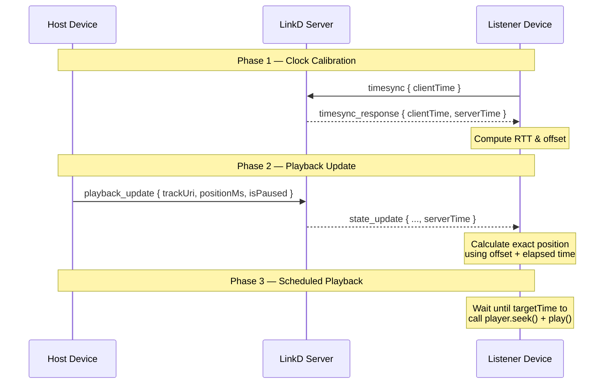

# LinkD — Zero-Delay Music Sync: Flutter Integration Guide

> **Audience:** Flutter app developers integrating with the LinkD backend.
> **Backend version:** Post audio-sync patch (Aug 2025).

---

## TL;DR — What Changed in the Backend

| Change | Why |
|---|---|
| New `timesync` socket event | Lets every client calculate its clock offset vs the server |
| `serverTime` field added to **every** `state_update` payload | Clients can compute exact playback position accounting for network latency |
| Broadcast-first pattern on `playback_update` | Socket events fire **before** the DB write — eliminates 100–300 ms of DB latency from the hot path |
| `sync_music` now replies only to the requesting socket | Prevents unnecessary re-syncs on devices that are already in sync |
| `join_room` now auto-sends current playback state | New joiners start playback immediately without a separate sync request |

---

## Architecture Overview



---

## Step 1: Time Sync Protocol (NTP-Lite)

Every device's `DateTime.now()` is slightly different. To synchronize, each client must determine its **clock offset** relative to the server. This is the most critical step — skip this and you will always have a delay.

### How It Works

```
Client sends:  { clientTime: T1 }         (T1 = DateTime.now().millisecondsSinceEpoch)
Server responds: { clientTime: T1, serverTime: T2 }

Client receives response at T3 = DateTime.now().millisecondsSinceEpoch

RTT          = T3 - T1
oneWayDelay  = RTT ~/ 2
serverOffset = T2 - (T1 + oneWayDelay)
             = T2 - T1 - RTT ~/ 2

After calibration:
currentServerTime() = DateTime.now().millisecondsSinceEpoch + serverOffset
```

### Implementation (Dart)

Using the `socket_io_client` package:

```dart
import 'dart:async';
import 'package:socket_io_client/socket_io_client.dart' as io;

class TimeSync {
  final io.Socket socket;
  int _offset = 0;
  int _rtt = 0;
  final List<Map<String, int>> _samples = [];
  
  static const int sampleCount = 5;       // Run 5 pings, pick best
  static const Duration resyncInterval = Duration(seconds: 30); // Re-calibrate every 30s
  Timer? _autoSyncTimer;

  TimeSync(this.socket);

  /// Calibrate clock offset by sending multiple pings and
  /// taking the sample with the lowest RTT (most accurate).
  Future<void> calibrate() async {
    _samples.clear();

    for (int i = 0; i < sampleCount; i++) {
      await _ping();
      // Small delay between pings to avoid burst congestion
      await Future.delayed(const Duration(milliseconds: 100));
    }

    if (_samples.isEmpty) return;

    // Use the sample with the LOWEST RTT — it had the least
    // network jitter and is therefore the most accurate.
    final best = _samples.reduce((a, b) => a['rtt']! < b['rtt']! ? a : b);
    _offset = best['offset']!;
    _rtt = best['rtt']!;

    print('[TimeSync] Calibrated: offset=${_offset}ms, rtt=${_rtt}ms');
  }

  Future<void> _ping() {
    final completer = Completer<void>();
    final t1 = DateTime.now().millisecondsSinceEpoch;

    socket.emit('timesync', {'clientTime': t1});

    // Use `once` so handlers don't stack
    socket.once('timesync_response', (data) {
      final t3 = DateTime.now().millisecondsSinceEpoch;
      final clientTime = data['clientTime'] as int;
      final serverTime = data['serverTime'] as int;

      final rtt = t3 - clientTime;
      final oneWayDelay = rtt ~/ 2;
      final offset = serverTime - clientTime - oneWayDelay;

      _samples.add({'offset': offset, 'rtt': rtt});
      completer.complete();
    });

    return completer.future;
  }

  /// Returns the estimated current server time.
  /// Call this instead of DateTime.now().millisecondsSinceEpoch whenever you need
  /// to compare against server-provided timestamps.
  int now() {
    return DateTime.now().millisecondsSinceEpoch + _offset;
  }

  /// Returns the current estimated RTT in ms
  int get rtt => _rtt;

  /// Returns the clock offset in ms
  int get offset => _offset;

  /// Start periodic re-calibration. Call once after initial calibrate().
  void startAutoSync() {
    _autoSyncTimer?.cancel();
    _autoSyncTimer = Timer.periodic(resyncInterval, (_) => calibrate());
  }
  
  void dispose() {
    _autoSyncTimer?.cancel();
  }
}
```

### When to Calibrate

| Event | Action |
|---|---|
| Socket connected | `await timeSync.calibrate()` |
| App returns from background (AppLifecycleState.resumed) | `await timeSync.calibrate()` |
| Every 30 seconds | `timeSync.startAutoSync()` |
| After network change (Wi-Fi ↔ cellular) | `await timeSync.calibrate()` |

---

## Step 2: Handle `state_update` Events

Every `state_update` payload from the server now includes a `serverTime` field.

### Payload Model

```dart
class StateUpdate {
  final String roomCode;
  final String? currentTrackUri;
  final int currentPositionMs;
  final bool isPaused;
  final int updatedAt;
  final int serverTime;

  StateUpdate.fromJson(Map<String, dynamic> json)
      : roomCode = json['roomCode'],
        currentTrackUri = json['currentTrackUri'],
        currentPositionMs = json['currentPositionMs'],
        isPaused = json['isPaused'],
        updatedAt = json['updatedAt'],
        serverTime = json['serverTime'];
}
```

### Calculating Exact Playback Position

```dart
import 'dart:math';

int calculateExactPosition(StateUpdate payload, TimeSync timeSync) {
  if (payload.isPaused) {
    return payload.currentPositionMs;
  }

  // How much time has elapsed on the SERVER since the update
  final currentServerTime = timeSync.now();
  final elapsed = currentServerTime - payload.updatedAt;

  return payload.currentPositionMs + max(0, elapsed);
}
```

> [!IMPORTANT]
> **Do NOT use `DateTime.now().millisecondsSinceEpoch - payload.updatedAt`** to calculate elapsed time.
> That uses the client's uncalibrated clock and is the primary source of the 2-second drift.
> Always use `timeSync.now()` which accounts for the server–client clock offset.

---

## Step 3: Scheduled Playback (The Secret Sauce)

The biggest remaining source of desync is **playback startup latency** — the time between calling `player.play()` and audio actually coming out of the speaker. This varies by device (50–500 ms).

### The Fix: Schedule-and-Wait

Instead of playing immediately when you receive a `state_update`, schedule the seek+play for a short time in the future. This gives all devices a window to pre-buffer and start simultaneously. Assuming you're using a package like `just_audio` or `audioplayers`:

```dart
const scheduleBufferMs = 200; // Give all devices 200ms to prepare

socket.on('state_update', (data) async {
  final payload = StateUpdate.fromJson(data);
  final exactPositionMs = calculateExactPosition(payload, timeSync);

  if (payload.isPaused) {
    // ── PAUSE: execute immediately ──
    await player.pause();
    await player.seek(Duration(milliseconds: exactPositionMs));
    return;
  }

  // ── PLAY / SEEK: schedule for a precise future moment ──
  //
  // 1. Decide a "target server time" slightly in the future.
  //    All devices receiving this update will pick the same target.
  final targetServerTime = payload.serverTime + scheduleBufferMs;

  // 2. How long do we need to wait (in local clock terms)?
  final waitMs = targetServerTime - timeSync.now();

  // 3. Where will the track be at the target time?
  final targetPositionMs = exactPositionMs + max(0, waitMs);

  if (waitMs > 0) {
    // Pre-buffer: seek first, then wait, then play
    await player.seek(Duration(milliseconds: targetPositionMs));

    // Use a high-resolution timer if available
    await preciseWait(waitMs);

    await player.play();
  } else {
    // We're late — the target time already passed.
    // Just seek to the corrected position and play now.
    await player.seek(Duration(milliseconds: targetPositionMs + waitMs.abs()));
    await player.play();
  }
});
```

### High-Resolution Wait

`Future.delayed` in Dart is usually accurate, but for sub-frame accuracy, use a `Stopwatch` for the final few milliseconds:

```dart
Future<void> preciseWait(int ms) async {
  if (ms <= 0) return;

  final stopwatch = Stopwatch()..start();
  
  // Use Future.delayed for the bulk of the wait to free up the event loop
  final coarseMs = max(0, ms - 10);
  if (coarseMs > 0) {
    await Future.delayed(Duration(milliseconds: coarseMs));
  }
  
  // Spin-wait for the last ~10ms for precision
  while (stopwatch.elapsedMilliseconds < ms) {
    // busy-wait
  }
  
  stopwatch.stop();
}
```

---

## Step 4: Full Integration Example

Here's how everything fits together in a Flutter client:

```dart
// ── Initialization ──────────────────────────────────────
import 'package:socket_io_client/socket_io_client.dart' as io;

late io.Socket socket;
late TimeSync timeSync;
String? currentlyPlayingUri;

void initSocket(String userJwt) {
  socket = io.io('https://your-linkd-server.com', <String, dynamic>{
    'transports': ['websocket'],
    'auth': {'token': userJwt},
  });

  timeSync = TimeSync(socket);

  socket.onConnect((_) async {
    // 1. Calibrate clock FIRST, before joining any room
    await timeSync.calibrate();
    timeSync.startAutoSync();

    // 2. Join the room — backend will auto-send current playback state
    socket.emit('join_room', {'roomCode': 'ABC123'});
  });

  // ── Playback Sync ───────────────────────────────────────
  socket.on('state_update', (data) async {
    final payload = StateUpdate.fromJson(data);
    final exactPositionMs = calculateExactPosition(payload, timeSync);

    if (payload.currentTrackUri != currentlyPlayingUri) {
      // Track changed — load new track first
      currentlyPlayingUri = payload.currentTrackUri;
      if (currentlyPlayingUri != null) {
        await player.setUrl(currentlyPlayingUri!);
      }
    }

    if (payload.isPaused) {
      await player.pause();
      await player.seek(Duration(milliseconds: exactPositionMs));
    } else {
      // Schedule playback (see Step 3)
      await schedulePlayback(payload, exactPositionMs);
    }
  });
}

// ── Host: Broadcasting Updates ──────────────────────────
Timer? _hostBroadcastTimer;

// As the host, periodically report your actual playback position
// so listeners can correct any drift.
void startHostBroadcast(String roomCode) {
  _hostBroadcastTimer?.cancel();
  _hostBroadcastTimer = Timer.periodic(const Duration(seconds: 5), (_) async {
    final position = player.position.inMilliseconds;
    final isPaused = !player.playing;

    socket.emit('playback_update', {
      'roomCode': roomCode,
      'currentTrackUri': currentlyPlayingUri,
      'currentPositionMs': position,
      'isPaused': isPaused,
    });
  });
}

void stopHostBroadcast() {
  _hostBroadcastTimer?.cancel();
}
```

---

## Step 5: Drift Correction (Continuous Sync)

Even with perfect initial sync, audio playback speed varies slightly between devices (clock drift). Implement gradual correction:

```dart
const maxDriftMs = 50;       // Tolerable drift before correcting
const correctionRate = 0.1;  // Adjust 10% of the drift per cycle

Future<void> correctDrift(StateUpdate payload, TimeSync timeSync) async {
  if (payload.isPaused) return;

  final expectedPosition = calculateExactPosition(payload, timeSync);
  final actualPosition = player.position.inMilliseconds;
  final drift = expectedPosition - actualPosition;

  if (drift.abs() > maxDriftMs) {
    if (drift.abs() > 2000) {
      // Large drift — hard seek
      await player.seek(Duration(milliseconds: expectedPosition));
    } else {
      // Small drift — soft correction
      // Nudge playback rate slightly to catch up or slow down
      // Note: If using just_audio, you can also adjust player.setSpeed() slightly!
      final correction = (drift * correctionRate).round();
      await player.seek(Duration(milliseconds: actualPosition + correction));
    }
  }
}
```

> [!NOTE]
> The host device should broadcast `playback_update` every 5 seconds.
> Listeners use these updates for continuous drift correction.
> Do NOT broadcast more frequently — it wastes bandwidth and causes jitter.

---

## Socket Event Reference

### Client → Server

| Event | Payload | Description |
|---|---|---|
| `timesync` | `{'clientTime': int}` | Request clock calibration |
| `join_room` | `{'roomCode': String}` | Join a room's socket group |
| `playback_update` | `{'roomCode': String, 'currentTrackUri': String?, 'currentPositionMs': int, 'isPaused': bool}` | **Host only.** Broadcast current playback state |
| `sync_music` | `{'roomCode': String}` | Request current playback state (self only) |
| `pause_music` | `{'roomCode': String, 'positionMs': int?, 'isPaused': bool?}` | **Host only.** Pause/resume playback |
| `leave_room` | `{'roomCode': String}` | Leave a room's socket group |

### Server → Client

| Event | Payload | Description |
|---|---|---|
| `timesync_response` | `{'clientTime': int, 'serverTime': int}` | Clock calibration response |
| `state_update` | `{'roomCode': String, 'currentTrackUri': String?, 'currentPositionMs': int, 'isPaused': bool, 'updatedAt': int, 'serverTime': int}` | Playback state — use `serverTime` + offset for positioning |
| `listener_joined` | `{'userId': String, 'username': String}` | A new listener joined the room |
| `listener_left` | `{'userId': String, 'username': String}` | A listener left the room |
| `error` | `{'message': String}` | Error notification |

---

## Checklist Before Release

- [ ] `TimeSync.calibrate()` runs on socket connect, app foreground (WidgetsBindingObserver), and network change
- [ ] All position calculations use `timeSync.now()`, never raw `DateTime.now().millisecondsSinceEpoch`
- [ ] `state_update` handler uses `serverTime` field (not `updatedAt` alone)
- [ ] Playback is *scheduled* for a future target time, not triggered immediately
- [ ] Host broadcasts `playback_update` every ~5 seconds for drift correction
- [ ] Drift correction uses soft nudging for small drifts (< 2s), hard seek for large
- [ ] On `join_room`, client handles the auto-sent `state_update` for immediate sync
- [ ] `timesync` re-calibration runs every 30 seconds in the background

---

## Troubleshooting

| Symptom | Likely Cause | Fix |
|---|---|---|
| Consistent 1-2s delay on all listeners | No time sync / using raw `DateTime.now()` | Implement `TimeSync` class, use `timeSync.now()` |
| Random ±500ms jitter | Timer precision / no scheduled playback | Implement `preciseWait()` + schedule-and-wait pattern |
| Drift increases over time | No periodic correction | Add host broadcast every 5s + `correctDrift()` |
| One specific device always behind | Device clock is significantly wrong | Time sync handles this — ensure `calibrate()` ran |
| Sync breaks after app backgrounding | Clock offset stale | Re-calibrate on app foreground event using `WidgetsBindingObserver` |
| Audio starts but position is wrong | Using `updatedAt` instead of `serverTime` | Use `serverTime` field for elapsed time calculation |
